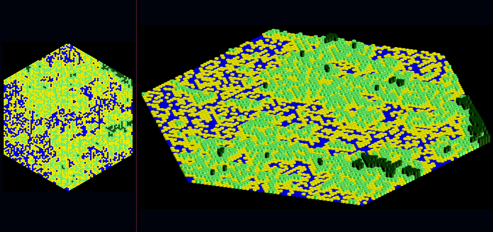
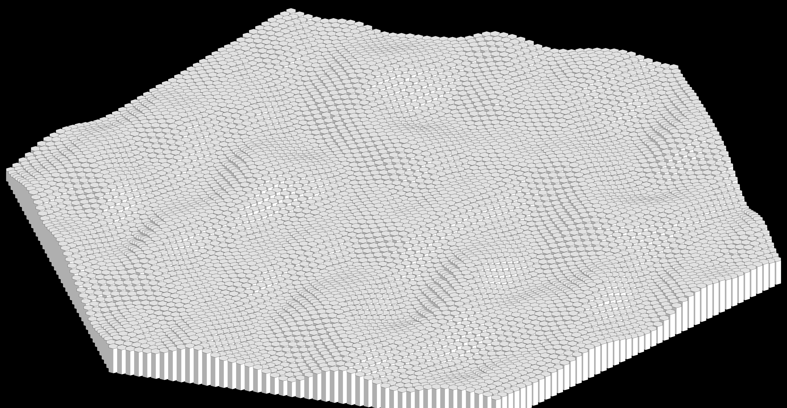

# WFC_HEX

A professional procedural world generator using Wave Function Collapse (WFC) and Noise Algorithms (Perlin, Ridged Multifractal) implemented on a hexagonal grid. This project features a high-performance C++17 core with real-time OpenGL visualization and a robust CLI for advanced generation control.

<p align="center">
    
    <br>
    
</p>

## 🚀 Features

- **Hexagonal Grid Engine**: Advanced axial and cube coordinate logic for seamless hex manipulation.
- **Wave Function Collapse (WFC)**: Procedural generation based on tile adjacency constraints and entropy.
- **Steppable Generation Interface**: Decoupled generation logic allowing real-time visualization of the WFC and River processes.
- **Noise Algorithms**: Integrated Perlin and Ridged Multifractal noise for heightmaps and biome distribution.
- **Real-time OpenGL Rendering**: Watch the world collapse and rivers flow step-by-step.
- **Robust CLI**: Complete control over seeds, map size, and rendering parameters via command line.
- **Automated Visualization**: Python pipeline for high-quality 2D and 2.5D (Isometric) map rendering.

## 🛠️ Setup

### 1. System Dependencies (Linux)
The C++ core requires OpenGL, GLFW, and standard build tools.
```
    sudo apt update
    sudo apt install build-essential libglfw3-dev libgl1-mesa-dev libx11-dev libxi-dev libxrandr-dev -y
```

### 2. Python Environment
Required for post-processing and isometric visualization.

```
    # Create and activate virtual environment
    python3 -m venv venv
    source venv/bin/activate

    # Install dependencies
    pip install -r requirements.txt
```

## 💻 Usage

The project uses a versatile Makefile to manage builds and execution.

### Basic Commands
- **make**: Compiles the main application.
- **make run**: Compiles and runs the simulation with default parameters.
- **make headless**: Runs the generation without the OpenGL window (ideal for batch processing).
- **make help**: Displays a detailed list of all available commands and variables.

### CLI Configuration
You can pass parameters directly through the `make` command:

```
    make run radius=50 render=true step=50 args="--wfc-seed 12345"
```

### Available Flags (via `args` or direct CLI)
- `--map-radius`: Size of the hexagonal grid.
- `--opengl-render`: Enables the visual simulation window.
- `--opengl-step-counter`: Speed of the visual update (frames per N steps).
- `--wfc-seed`: Seed for the Wave Function Collapse algorithm.
- `--hf-perlin-seed`: Seed for the heightmap generation.
- `--river-ridged-seed`: Seed for the river generation.

## 🧪 Testing & Noise Validation

The testing pipeline allows isolated validation of algorithms and geometry.

- **Run all tests**: `make test`
- **Run a specific test**: `make test name=perlin radius=60`

The raw data is saved in `bin/output/` and visualized images in `img/test/`.

## 📂 Project Structure

- `WFC_Core/`:
    - `engine/`: 
        - `generators/`: WFC and River logic (including `StepGenerator` interface).
        - `noises/`: Noise algorithm implementations.
        - `render/`: OpenGL window and simulation management.
    - `cli/`: Command-line argument parsing logic.
    - `models/`: Hexagonal grid, Cell, and Map data structures.
- `scripts/`: Python models and visualization scripts (OpenCV/NumPy).
- `tools/`: Bash automation for the build and run pipeline.
- `bin/`: Compiled binaries and raw output data.
- `img/`: Final rendered maps (Top-down and Isometric).

## 🔗 Useful Links

- [Red Blob Games - Hexagonal Grids](https://www.redblobgames.com/grids/hexagons/): The core math behind this project.
- [WFC Explained](https://blog.ptidej.net/procedural-generation-using-wave-function-collapse/): Understanding the algorithm.
- [Procedural Generation | Bitwise](https://youtu.be/-POwgollFeY): Inspiration for noise integration.
