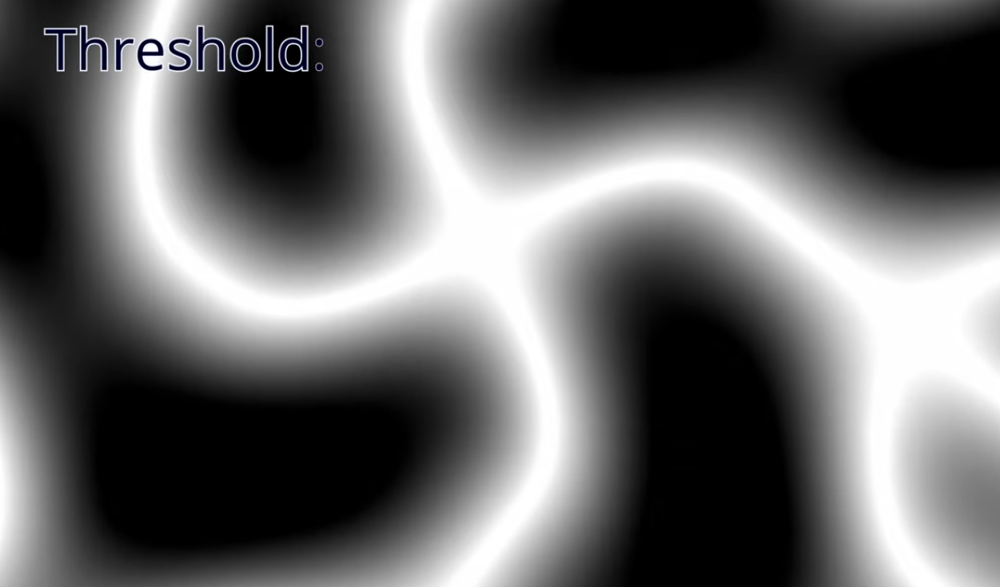
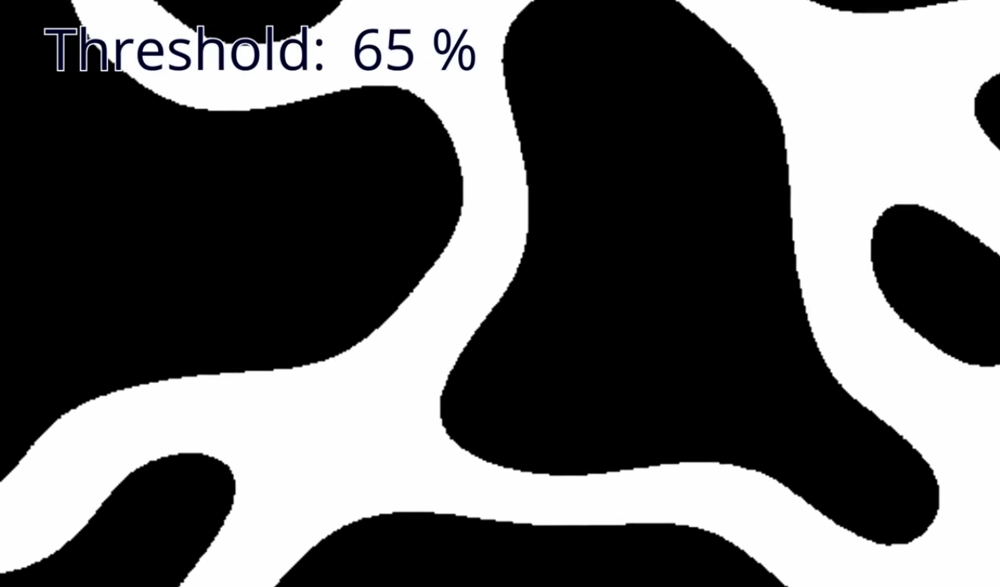
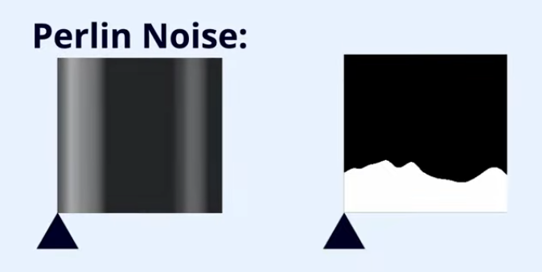

# Water Ruleset
- somehow, make water ruleset be based on a 'direction', trying to simulate a river

    

### Possible Solution!

- Ridged Multifractal Noise with High Threshold

- No Threshold

    

- High Threshold

    

# Height Rulset
- Make a soft height transition between Cells

### Possible Solution!

- Perlin Noise

    

